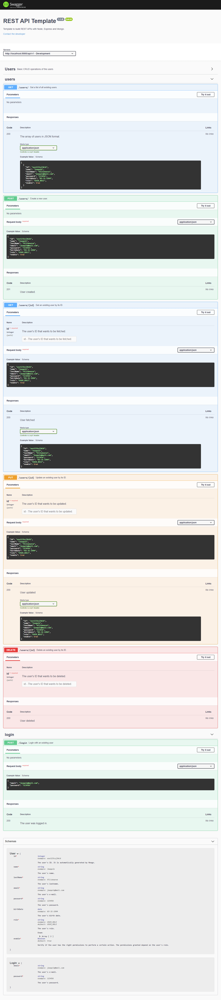

<h1 align="center">Welcome to REST API Template 👋</h1>
<p>
  
  
  
  <a href="#" target="_blank">
    
  </a>
</p>

> Template to develop a RESTful API with Node, Express and Mongo.

## Prerequisites

- node 14.8.0
- npm 7.5.3

## Install

```sh
npm install
```

## Usage

```sh
npm run start
```

## Run tests

```sh
npm run test
```

## Documentation



## Author

👤 **Joaquín Villanueva**

- Website: https://j-villanueva.web.app
- Twitter: [@\_JoaquinScript](https://twitter.com/_JoaquinScript)
- Github: [@joaq-uinv](https://github.com/joaq-uinv)
- LinkedIn: [@joaquinvillanueva](https://linkedin.com/in/joaquinvillanueva)

## 🤝 Contributing

Contributions, issues and feature requests are welcome!<br />Feel free to check [issues page](https://github.com/joaq-uinv/rest_api_template/issues). You can also take a look at the [contributing guide](https://github.com/joaq-uinv/rest_api_template/blob/master/CONTRIBUTING.md).

## Show your support

Give a ⭐️ if this project helped you!

---

_This README was generated with ❤️ by [readme-md-generator](https://github.com/kefranabg/readme-md-generator)_
